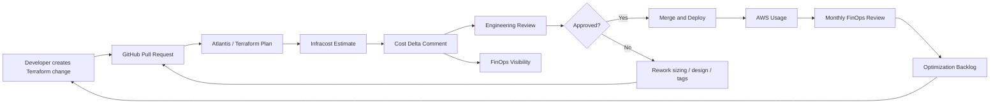

# Run FinOps Practice: Infracost in Every Terraform PR + AWS Cost Optimization

## Executive Summary

This repository documents a **9-month DevOps / FinOps program** focused on introducing cost visibility into the AWS infrastructure delivery process.

The organization was running a growing AWS-based platform with containerized workloads on EKS. Platform traffic was increasing by approximately **35% year over year**, but AWS infrastructure spend was growing faster than expected. The monthly AWS run-rate reached approximately **$173K/month**, while infrastructure changes were still being reviewed mainly from a technical perspective.

The project introduced a practical FinOps control into the engineering workflow:

> Every meaningful Terraform Pull Request had to show estimated monthly cost impact before merge.

This changed the delivery model from reactive billing review to proactive engineering cost governance.

## Outcome Snapshot

| Area | Result |
|---|---:|
| AWS monthly spend before | **$173K/month** |
| AWS monthly spend after | **$135K/month** |
| Monthly savings run-rate | **$38K/month** |
| YoY improvement vs prior trajectory | **~22%** |
| Savings Plans + RI coverage | **82%** |
| Engineering teams onboarded | **6 teams** |
| Terraform repositories covered | **14 repositories** |
| AWS accounts in scope | **8 accounts** |
| Time to first visible savings | **3 months** |
| Time to full measured run-rate savings | **6 months** |
| Project duration | **9 months** |
| Core delivery team | **9 people** |
| Extended stakeholders | **~24 people** |

## My Role

**Role:** IT Project / Infrastructure Coordinator / Project Lead  
**Project type:** DevOps / FinOps / AWS Cost Optimization  
**Delivery model:** Agile delivery with monthly FinOps governance  
**Environment:** AWS, EKS, Terraform, GitHub, Atlantis, Infracost, Kubecost, AWS Cost Explorer  
**Status:** Completed and operationalized

I coordinated the program across Cloud Engineering, DevOps, Product, Finance / FinOps and application stakeholders. My responsibility was to turn a tooling improvement into a working operating model with clear ownership, reporting, adoption and measurable business outcomes.

## Team and Stakeholders

This was delivered as a cross-functional initiative, not as a standalone automation task.

| Role | Count | Responsibility |
|---|---:|---|
| IT Project / Infrastructure Coordinator | 1 | project lead, planning, reporting, risks, stakeholder management |
| Cloud Engineers | 2 | AWS architecture review, rightsizing, Savings Plans and RI analysis |
| DevOps Engineers | 2 | GitHub, Atlantis, Terraform workflow and Infracost integration |
| FinOps / Finance Analyst | 1 | spend validation, KPI tracking, savings reporting |
| Product Owner | 1 | business prioritization and adoption support |
| Engineering Manager / Platform Owner | 1 | team adoption and technical governance |
| Security / Compliance Representative | 1 | access, anonymization and governance alignment |

## Business Context

The AWS platform was scaling quickly. Engineering teams were deploying new services, increasing Kubernetes capacity and expanding supporting infrastructure such as databases, load balancers, storage and observability components.

Before the project:

- Terraform Pull Requests did not consistently show monthly cost impact.
- Engineers could approve infrastructure changes without seeing cost delta.
- AWS spend was reviewed mostly after deployment.
- Savings Plans and Reserved Instances were managed reactively.
- Cost ownership between Engineering, Product and Finance was unclear.
- Leadership lacked a simple view of whether platform growth was cost-efficient.

## Why the Project Was Launched

The project was started because AWS spend was rising faster than expected. The issue was not simply that cloud cost was high. The bigger issue was that cost decisions were happening too late.

Month-end billing reports showed the impact after infrastructure had already changed. By that time, the change was harder to challenge, harder to reverse and harder to attribute.

The project goal was to move cost visibility to the point where decisions were actually made: **the Terraform Pull Request**.

## What We Implemented

### 1. Cost visibility in every relevant Terraform PR

Each infrastructure PR included:

- Terraform plan context
- estimated before cost
- estimated after cost
- monthly delta
- affected resource summary
- reviewer recommendation for high-impact changes

### 2. Infracost in the delivery workflow

Infracost was integrated into the Terraform PR process to calculate and publish cost estimates before merge.

The goal was not invoice-level precision. The goal was decision-quality visibility before deployment.

### 3. FinOps governance model

We introduced a monthly FinOps cadence covering:

- spend trend review
- anomaly review
- idle / underused resource review
- Savings Plans and RI coverage
- optimization backlog
- KPI reporting
- owner assignment

### 4. Commitment optimization

Savings Plans and Reserved Instances were reviewed as a managed process instead of a one-time purchase decision.

Focus areas:

- stable compute usage
- EKS workload patterns
- coverage gaps
- renewal planning
- overcommitment risk
- measured savings validation

## Delivery Roadmap

| Phase | Duration | Main focus | Output |
|---|---:|---|---|
| Phase 1 | 4 weeks | Discovery and baseline | cost baseline, stakeholder map, KPI set |
| Phase 2 | 6 weeks | FinOps foundation | governance model, ownership and reporting standard |
| Phase 3 | 8 weeks | PR cost visibility | Infracost rollout, PR comments, reviewer training |
| Phase 4 | 12 weeks | AWS optimization | coverage improvement, rightsizing, optimization backlog |
| Phase 5 | ongoing | Operationalization | monthly reviews, dashboards, continuous optimization |

## Solution Flow

## Results and Business Value

| Metric | Before | After |
|---|---:|---:|
| AWS monthly spend | $173K | $135K |
| Monthly savings | - | $38K/month |
| Cost governance | informal / reactive | implemented |
| Savings Plans + RI coverage | inconsistent | 82% |
| Terraform PR cost visibility | not standardized | implemented across repositories |
| Monthly FinOps reviews | not formalized | established |

The most important business value was not only the savings number. The project created a repeatable mechanism for preventing unmanaged cost growth while still supporting platform expansion.

## Repository Contents

| Path | Purpose |
|---|---|
| `docs/project-charter.md` | scope, objectives and business justification |
| `docs/business-case.md` | baseline, value case and measurable outcomes |
| `docs/implementation-roadmap.md` | phased delivery plan with timeline |
| `docs/stakeholder-and-team-model.md` | team model, stakeholders and communication |
| `docs/finops-operating-model.md` | monthly governance and ownership model |
| `docs/architecture.md` | architecture and process diagrams |
| `docs/adoption-strategy.md` | rollout and change-management approach |
| `governance/raci-matrix.md` | role accountability model |
| `governance/raid-log.md` | risks, assumptions, issues and dependencies |
| `dashboards/` | KPI dashboard documentation |
| `reports/` | executive and monthly reporting examples |
| `diagrams/` | Mermaid sources and PNG generation prompts |

## Key Lessons Learned

1. FinOps works best when embedded into engineering workflows.
2. Cost visibility before merge is more useful than cost reporting after deployment.
3. Engineers respond better to cost data when it is contextual and actionable.
4. Commitment optimization requires ongoing governance, not one-time purchasing.
5. Tagging quality is a governance dependency, not an administrative detail.
6. Dashboards only matter when connected to owner-driven actions.
7. The cultural change is harder than the technical integration.

## Portfolio Positioning

This repository is written as a **Project / Technical Program Management portfolio case study**. It intentionally avoids production Terraform code and sensitive AWS details. The focus is on business problem solving, cross-functional delivery, governance, architecture, adoption and measurable outcomes.
