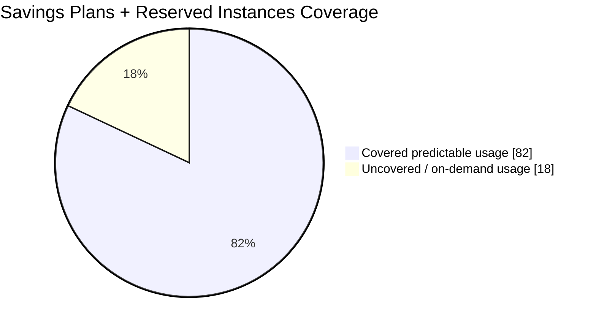

# Executive KPI Dashboard

## Purpose

This dashboard is designed for leadership and steering-level communication. It summarizes whether the project delivered measurable business value and whether the FinOps operating model is working.

## KPI Summary

| KPI | Value |
|---|---:|
| AWS monthly spend before | $173K/month |
| AWS monthly spend after | $135K/month |
| Monthly savings run-rate | $38K/month |
| Savings Plans + RI coverage | 82% |
| Engineering teams onboarded | 6 |
| Terraform repositories covered | 14 |
| AWS accounts in scope | 8 |
| Time to first visible savings | 3 months |
| Time to full measured run-rate impact | 6 months |

## Spend Before / After

```text
AWS Monthly Spend

Before     $173K | ##################################
After      $135K | ###########################
Savings     $38K | ########
```

## Commitment Coverage



## Executive Interpretation

The program reduced monthly AWS spend while supporting continued platform growth. The key change was not only the savings result, but the creation of a repeatable governance mechanism that makes cost visible before infrastructure changes are approved.
