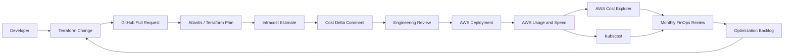
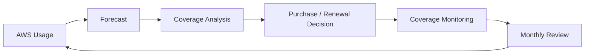

# Mermaid Diagram Sources

## End-to-End FinOps Architecture

```mermaid
flowchart LR
    DEV[Developer] --> TF[Terraform Change]
    TF --> PR[GitHub Pull Request]
    PR --> ATL[Atlantis / Terraform Plan]
    ATL --> IC[Infracost Estimate]
    IC --> CMT[Cost Delta Comment]
    CMT --> REV[Engineering Review]
    REV --> DEP[AWS Deployment]
    DEP --> AWS[AWS Usage and Spend]
    AWS --> CE[AWS Cost Explorer]
    AWS --> KC[Kubecost]
    CE --> FIN[Monthly FinOps Review]
    KC --> FIN
    FIN --> BACKLOG[Optimization Backlog]
    BACKLOG --> TF
```

## Before vs After Governance

```mermaid
flowchart TB
    subgraph Before[Before: Reactive Cost Management]
        B1[Infrastructure deployed] --> B2[AWS bill increases]
        B2 --> B3[Finance detects issue]
        B3 --> B4[Engineering investigates]
        B4 --> B5[Late optimization]
    end

    subgraph After[After: Shift-Left FinOps]
        A1[Terraform PR] --> A2[Cost estimate]
        A2 --> A3[Review before merge]
        A3 --> A4[Approve or redesign]
        A4 --> A5[Controlled deployment]
        A5 --> A6[Monthly FinOps review]
    end
```

## Savings Plans Optimization Cycle

```mermaid
flowchart LR
    U[AWS Usage] --> F[Forecast]
    F --> A[Coverage Analysis]
    A --> D[Purchase / Renewal Decision]
    D --> M[Coverage Monitoring]
    M --> R[Monthly Review]
    R --> U
```
