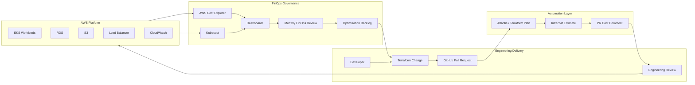
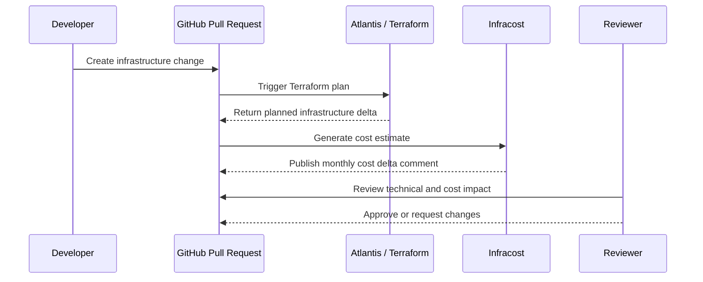

# Architecture

## Architecture Overview

The solution architecture embedded cost estimation into the infrastructure delivery workflow. The system did not replace Terraform, GitHub or Atlantis. It extended the existing workflow with cost visibility and governance.

## High-Level Architecture

## Terraform Pull Request Flow

## Architecture Layers

### Engineering Delivery Layer

- developers
- cloud engineers
- Terraform changes
- GitHub Pull Requests
- code review and approvals

### Automation Layer

- Atlantis / Terraform plan
- Infracost estimate
- PR cost comment

### AWS Platform Layer

- EKS / ECS workloads
- RDS databases
- S3 storage
- Application Load Balancers
- CloudWatch metrics and logs
- IAM roles and policies

### FinOps Governance Layer

- AWS Cost Explorer
- Kubecost
- dashboards
- monthly FinOps review
- optimization backlog

## Why This Architecture Worked

The architecture worked because it did not create a detached governance system. Cost visibility was added to the existing engineering workflow, directly at the decision point.
