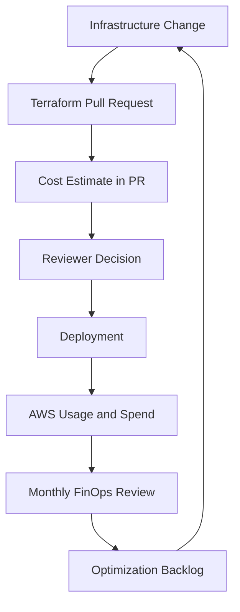

# FinOps Operating Model

## Purpose

The operating model connected Engineering, Product and Finance around shared AWS cost ownership.

## Operating Principles

1. Cost is an engineering signal, not only a finance metric.
2. Cost impact should be visible before infrastructure changes are deployed.
3. Optimization actions must have owners and due dates.
4. Commitment coverage must be reviewed continuously.
5. Dashboards should support decisions, not only reporting.
6. Cloud cost governance must not block delivery unnecessarily.

## Core Process

## Monthly FinOps Review Agenda

1. AWS spend trend review
2. Month-over-month and year-over-year comparison
3. Cost anomalies
4. High-cost services and workloads
5. Savings Plans and RI coverage
6. Idle or underused resources
7. Open optimization backlog
8. Decisions and action owners
9. Executive summary preparation

## KPI Set

| KPI | Description | Owner |
|---|---|---|
| Monthly AWS Spend | total AWS run-rate | FinOps / Finance |
| Monthly Savings Run-Rate | value of implemented optimizations | FinOps / Cloud |
| Savings Plans + RI Coverage | covered predictable usage | Cloud / FinOps |
| Cost per Workload | cost by service or application group | Product / Engineering |
| Cost per Customer | efficiency of platform growth | Product / Finance |
| PR Cost Visibility | percentage of relevant PRs with cost estimate | DevOps |
| Idle Resources | resources with low or no utilization | Cloud Engineering |
| Forecast Accuracy | spend forecast vs actual | FinOps |

## Decision Logic

A cost increase could be approved when:

- it supported business growth
- it improved reliability or performance
- it was required for compliance or resilience
- lower-cost options were considered
- the owner accepted the new monthly run-rate

A cost increase required challenge when:

- sizing was not supported by usage data
- the change was precautionary without evidence
- tags or ownership were missing
- cheaper alternatives were not evaluated
