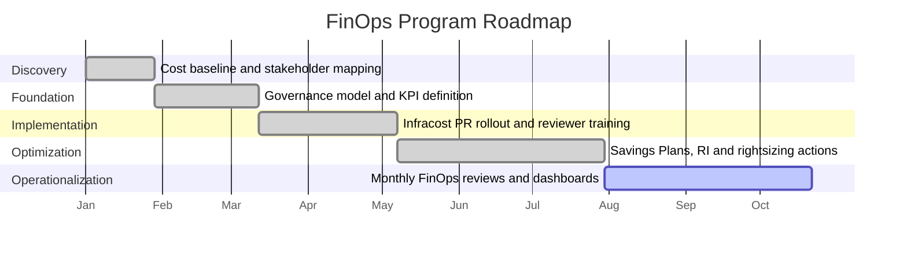

# Implementation Roadmap

## Roadmap Summary

The program was delivered over approximately 9 months using phased Agile delivery. Work was split into discovery, foundation, implementation, optimization and operationalization.

## Phase 1 — Discovery and Baseline

**Duration:** 4 weeks

Activities:

- reviewed AWS monthly spend baseline
- identified major cost drivers
- reviewed Terraform and GitHub PR workflow
- mapped stakeholders and team ownership
- identified tagging and cost attribution gaps
- defined first KPI draft

Deliverables:

- baseline AWS monthly spend: approximately $173K/month
- initial risk register
- stakeholder map
- first version of KPI dashboard
- candidate optimization list

## Phase 2 — FinOps Foundation

**Duration:** 6 weeks

Activities:

- defined FinOps governance model
- agreed monthly review cadence
- defined cost ownership model
- agreed PR review expectations
- prepared communication and adoption plan
- aligned with Product and Finance on business reporting

Deliverables:

- FinOps operating model
- dashboard requirements
- RACI model
- tagging expectations
- executive update format

## Phase 3 — Shift-Left Cost Visibility

**Duration:** 8 weeks

Activities:

- integrated Infracost into the Terraform PR workflow
- aligned process with Atlantis-based Terraform planning
- configured PR cost comments
- piloted workflow with selected repositories
- collected reviewer feedback
- trained engineering teams
- expanded rollout to 14 Terraform repositories

Deliverables:

- PR cost visibility implemented
- reviewer guidance created
- cost-awareness checklist added
- engineering adoption completed across 6 teams

## Phase 4 — Optimization Execution

**Duration:** 12 weeks

Activities:

- reviewed Savings Plans and RI opportunities
- analyzed EKS / Kubernetes cost patterns through Kubecost
- identified rightsizing opportunities
- reviewed non-production usage
- created and prioritized optimization backlog
- assigned owners and tracked actions

Deliverables:

- commitment coverage increased to 82%
- optimization backlog operational
- AWS monthly spend run-rate reduced to approximately $135K/month
- monthly savings run-rate reached approximately $38K/month

## Time to Results

| Milestone | Timing |
|---|---:|
| Baseline complete | Month 1 |
| Governance model approved | Month 2 |
| First PR cost visibility pilot | Month 3 |
| First visible savings | Month 3 |
| Rollout across repositories | Month 4–5 |
| Full measured savings run-rate | Month 6 |
| Operationalized monthly review | Month 6 onward |
